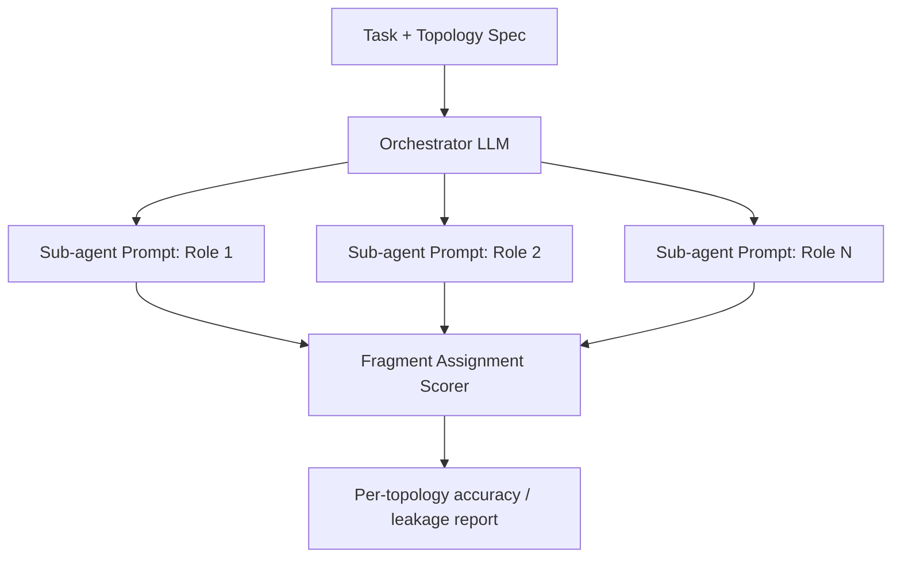

## Problem

Multi-agent systems depend on an orchestrator correctly splitting a task's information among sub-agent roles: which fragment goes to which role, what each sub-agent is and is not told, and how that translates into the literal prompt text each sub-agent receives. End-to-end evals (execution success, tool-call correctness) and topology definitions (who talks to whom) both assume this hand-off step is done correctly, but neither tests it directly. A sub-agent can still stumble through a task with an incomplete or wrongly-scoped prompt, masking an orchestration bug until the system is scaled to harder tasks or unfamiliar topologies, where mis-assigned information becomes the dominant failure mode.

## Solution

Treat "writing correct sub-agent prompts" as a skill to benchmark on its own, separate from whether the end task ultimately succeeds. For each of a set of scenarios spanning distinct communication topologies:

1. Define the ground-truth information fragments required for the task and the role that legitimately needs each fragment.
2. Ask the orchestrator LLM to decompose the task and write the actual prompt text for every sub-agent role in that topology.
3. Score each generated sub-agent prompt against the ground truth: did it receive every fragment its role needs (recall), does it withhold fragments that role should not see (leakage), and is each fragment routed to the correct role rather than a neighboring one (assignment accuracy)?
4. Aggregate scores per topology to see where orchestration quality degrades — chain and star topologies typically stress this less than deeper tree or mesh topologies with many-to-many hand-offs.

This is deliberately orthogonal to [Workflow Evals with Mocked Tools](workflow-evals-with-mocked-tools.md) (scores whether the right *tools* get called) and to [Declarative Multi-Agent Topology Definition](declarative-multi-agent-topology-definition.md) (specifies the agent graph but not whether prompts populate it correctly). It is closer to a unit test for the hand-off step itself.

## Evidence

- **Evidence Grade:** low-medium. This is a single benchmark paper at time of writing, with no independent replication yet.
- **Most Valuable Finding:** building the eval around topology variation, rather than one fixed topology, surfaces a failure mode a fixed-topology eval suite would miss: fragment-assignment quality varies unevenly across topologies.
- **Unverified / Unclear:** how well benchmark performance predicts end-to-end task success in production systems; generalization beyond the paper's reported scenarios and topologies has not been independently confirmed. Verify current figures against the source before citing them.

## How to use it

- Use when you are building or hardening a multi-agent system and want a regression suite for the orchestrator's *delegation quality*, not just final output quality.
- Write a handful of scenarios per topology you actually use (chain, star, tree, fan-out/fan-in, debate, mesh); you do not need every topology to get value.
- Score three things per generated sub-agent prompt: required-fragment recall, forbidden-fragment leakage, and role-assignment accuracy.
- Run this alongside — not instead of — end-to-end workflow evals; it catches a different class of bug (mis-delegation) than tool-call or output-format evals do.
- Re-run whenever you change the topology or swap the orchestrator model.

## Trade-offs

**Pros:**

- Isolates delegation-quality bugs that end-to-end evals otherwise blame on the wrong sub-agent.
- Topology-indexed scoring shows exactly where orchestration degrades as systems scale past simple chains/stars.
- Cheap to extend: new scenarios are just (topology, fragments, ground-truth assignment) tuples.

**Cons:**

- Requires hand-authoring ground-truth fragment/role assignments per scenario, which does not scale automatically to a new domain.
- A single benchmark; treat absolute scores as directional until independently replicated.
- Does not replace end-to-end evals — a system can score well here and still fail downstream for unrelated reasons (bad tools, bad models).

## References

- Sun, Y. et al. *PerspectiveGap: A Benchmark for Multi-Agent Orchestration Prompting*. arXiv:2606.08878. Code: https://github.com/WhymustIhaveaname/PerspectiveGap.
- Related: [Declarative Multi-Agent Topology Definition](declarative-multi-agent-topology-definition.md) — defines the agent graph this pattern tests prompt hand-offs against.
- Related: [Subject Hygiene for Task Delegation](subject-hygiene.md) — traceability of task subjects; this pattern instead tests information-content correctness of the delegation itself.
- Related: [Workflow Evals with Mocked Tools](workflow-evals-with-mocked-tools.md) — complementary eval angle (tool-call correctness vs. delegation-prompt correctness).
- Related: [Sub-Agent Spawning](sub-agent-spawning.md) — describes how the main agent creates the sub-agent invocations this pattern scores; this pattern checks whether those invocations actually carry the right information.
- FIPA. "FIPA ACL Communicative Act Library Specification." 2002 — theoretical foundation for structured inter-agent communication that this benchmark operationalizes as a measurable score.
